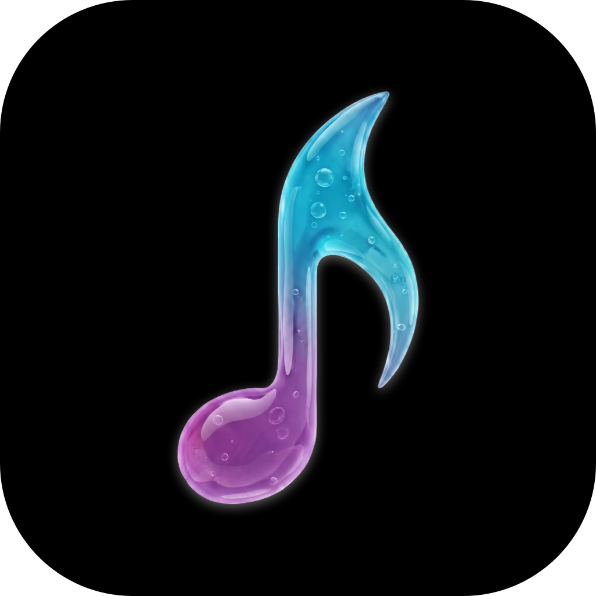
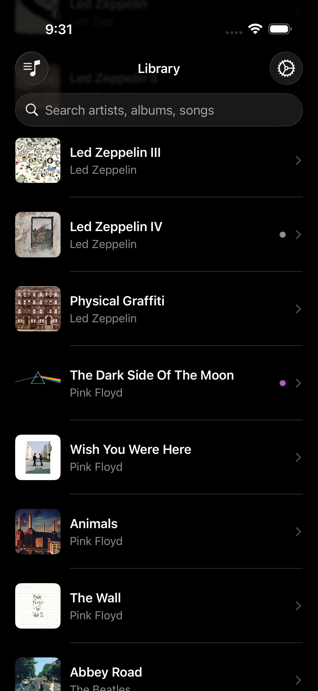
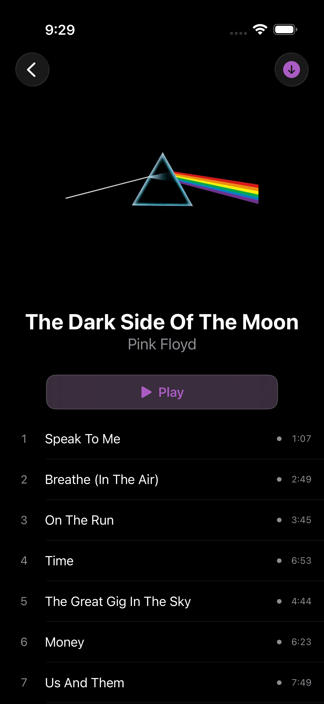
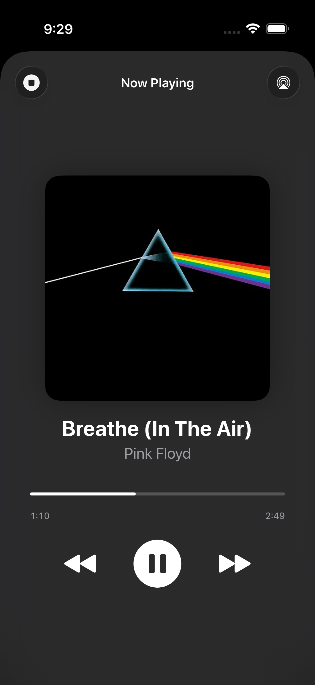
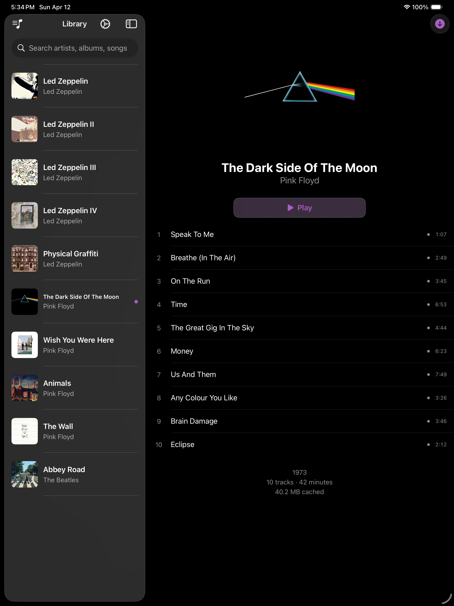
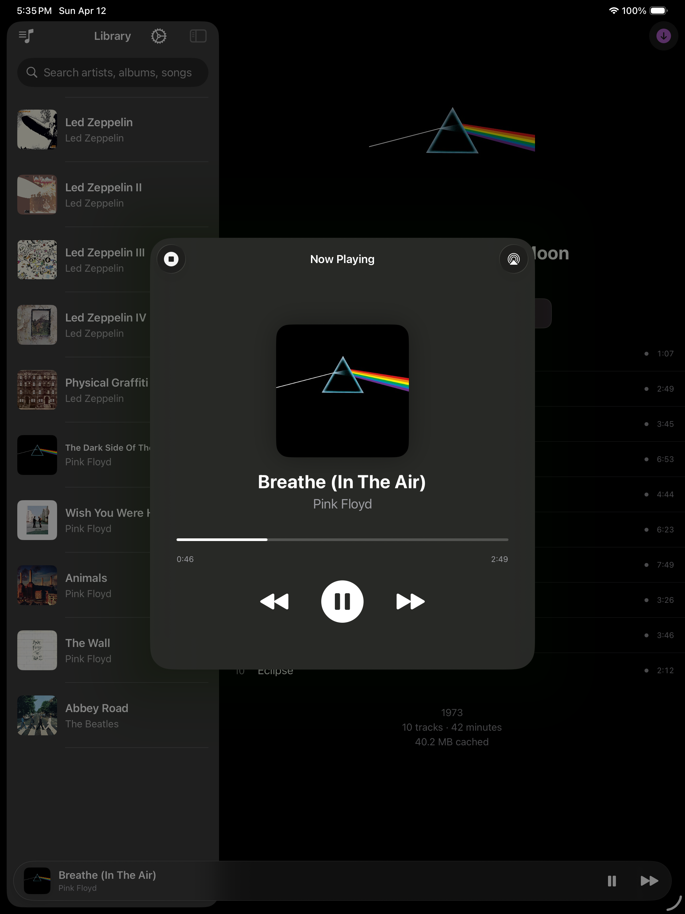

  

    

      
    

    <h3><b>Dorsal</b></h3>
    
An album-focused iOS/iPadOS music player for Jellyfin.

    
Your digital record shelf and player.

  

   
  

    
    
  

### Features

- 100% native Swift, built for iOS/iPadOS (also works on macOS devices with Apple silicon)
- Excellent CarPlay, Siri, and AirPlay support
- Gapless playback
- Equalizer (10-band)
- Offline-focused, network-friendly
  - Cache/download only (no streaming)
  - Once a song is listened to, it remains available offline forever
  - Once album art is fetched, it remains available offline forever
  - Fetch/sync data once upon first login, then only manually after that
  - Cache usage visibility (all, by album, and by song)
  - Cache clearing control (all, or by album)
  - Cache quality options (full or transcoded AAC)

### Purposeful non-features (for now)

- No shuffle, repeat, queuing, etc.
- No playlists, collections, genres, favourites, etc.

### Usage

To support development and get full lifetime access to the official release, it is available for purchase (4.99 USD) on the App Store. There will **never** be in-app purchases or subscriptions to unlock anything.

To get the app for free, you are encouraged to clone and install on your own iOS device. You can also get it through the TestFlight open beta. Both of these are a great way to find and report bugs!

Please do not clone and redistribute on the App Store as a competitor, as this is just not a nice thing to do.

### FAQ

What is the difference between "Cached" and "Downloaded"?

Cached means the song is available offline, and Downloaded means every song on the entire album is cached and protected from cache clearing.

### Localization

- [x] English
- [x] French
- [x] German
- [x] Spanish
- [x] Dutch
- [x] Swedish
- [x] Norwegian
- [x] Finnish
- [x] Italian
- [x] Japanese
- [x] Portuguese (Portugal)
- [x] Portuguese (Brazil)
- Request more!

### Screenshots

#### iPhone

  
  
  

#### iPad

  
  

#### CarPlay

Coming soon...